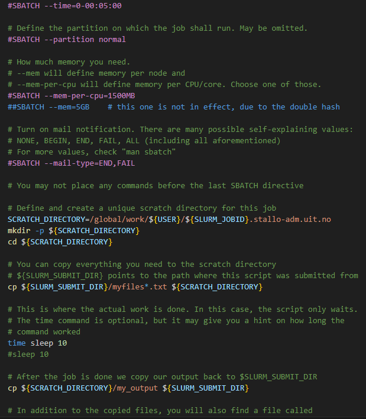

# SBATCH Syntax Highlighting and SLURM Job Submission for VS Code

This extension provides syntax highlighting and job submission features for `.sbatch` files used with SLURM job scheduling.

## Features

- Syntax highlighting for `.sbatch` files, including differentiation between active `#SBATCH` commands and commented `##SBATCH` lines.
- Right-click on `.sbatch` files to submit a SLURM job directly from VS Code.
- File icon for `.sbatch` files for easy identification.
- File icons for most common file types used in HPC.
- Default Icon for unknown file types.
- Folder Icon for directories.

## Installation
- Install the extension from the [VS Code Marketplace](https://marketplace.visualstudio.com/items?itemName=ephi052.vscode-sbatch).
- For icon support, on the extension installation page, click on the **Set icon theme** button and select the HPC Icon Theme.

## How to Use

1. Open any `.sbatch` file in VS Code to see syntax highlighting.
2. Right-click on the `.sbatch` file in the file explorer and select **Submit a SLURM Job from This File** to submit the job.

### Syntax Highlighting

- Active `#SBATCH` commands are highlighted in **purple**.
- Commented `##SBATCH` lines are highlighted in **blue**.
- General comments are highlighted in **green**.
- The rest of the text follows standard **bash** syntax colors.

## Requirements

Make sure `sbatch` (the SLURM command) is available in your system's PATH.

## Release Notes

For build instructions, see [build.md](./build.md)
For the license, see [LICENSE](./LICENSE.md)
### 0.0.1
- Initial release with syntax highlighting and SLURM job submission command.

---

For more information, visit [our repository](https://github.com/ephi052/VS-Code-SBATCH-Syntax-Highlighting).

